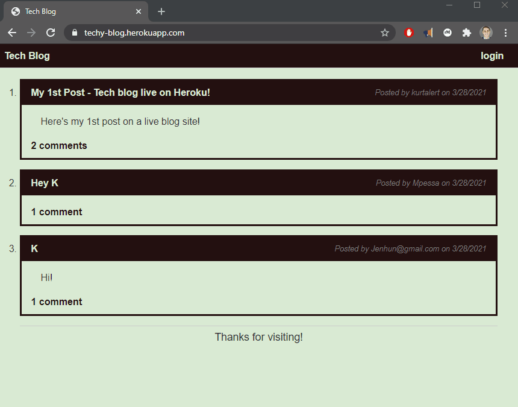

# tech-blog-challenge

## **Description**

In this repository, I created a CMS-style blog site that uses relational databases, an ORM (Sequelize) and MySQL to store data on posts, comments and users.  The blog allows users to publish articles, blog posts, and thoughts and opinions!

## **Table of Contents**

- [**Description**](#description)
- [**Table of Contents**](#table-of-contents)
- [**Installation**](#installation)
- [**Usage**](#usage)
- [**License**](#license)
- [**Contributing**](#contributing)
- [**Questions**](#questions)

## **Installation**

Run <code>npm install</code> once repository is cloned or downloaded.

## **Usage**

- [x] WHEN I visit the site for the first time
  THEN I am presented with the homepage, which includes existing blog posts if any have been posted; navigation links for the homepage; and the option to log in

- [x] WHEN I click on the homepage option
  THEN I am taken to the homepage

- [x] WHEN I click on any other links in the navigation
  THEN I am prompted to either sign up or sign in

- [x] WHEN I choose to sign up
  THEN I am prompted to create a username and password

- [x] WHEN I click on the sign-up button
  THEN my user credentials are saved and I am logged into the site
- [x] WHEN I revisit the site at a later time and choose to sign in
  THEN I am prompted to enter my username and password
- [x] WHEN I am signed in to the site
  THEN I see navigation links for the homepage, the dashboard, and the option to log out

- [x] WHEN I click on the homepage option in the navigation
  THEN I am taken to the homepage and presented with existing blog posts that include the post title and the date created

- [x] WHEN I click on an existing blog post
  THEN I am presented with the post title, contents, post creator’s username, and date created for that post and have the option to leave a comment
- [x] WHEN I enter a comment and click on the submit button while signed in
  THEN the comment is saved and the post is updated to display the comment, the comment creator’s username, and the date created

- [x] WHEN I click on the dashboard option in the navigation
  THEN I am taken to the dashboard and presented with any blog posts I have already created and the option to add a new blog post

- [x] WHEN I click on the button to add a new blog post
  THEN I am prompted to enter both a title and contents for my blog post

- [x] WHEN I click on the button to create a new blog post
  THEN the title and contents of my post are saved and I am taken back to an updated dashboard with my new blog post
- [x] WHEN I click on one of my existing posts in the dashboard
  THEN I am able to delete or update my post and taken back to an updated dashboard

- [x] WHEN I click on the logout option in the navigation
  THEN I am signed out of the site
- [x] WHEN I am idle on the page for more than a set time
  THEN I am automatically signed out of the site 

## **License**

 A short and simple permissive license with conditions only requiring preservation of copyright and license notices. Licensed works, modifications, and larger works may be distributed under different terms and without source code.

## **Contributing**

Feel free to contribute!

## **Questions**

Visit my [Github](http://www.github.com/kpessa) at github.com/kpessa